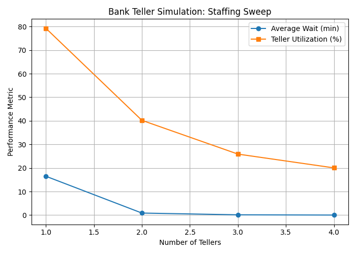

# CS4632 – Bank Teller Discrete-Event Simulation

### Author
**Jason Appolon**  
Department of Computer Science, Kennesaw State University  
Email: jappolon@students.kennesaw.edu  

---

## Project Overview
This project models a bank teller system using discrete-event simulation (DES) principles in Python with SimPy.  
Customers arrive randomly and wait in a shared queue to be served by one of several tellers.  
The simulation measures performance metrics such as average wait time, queue length, teller utilization, and throughput.

The goal is to explore how arrival rate (λ), service rate (μ), and number of tellers (c) influence system performance.

---

## Implementation Summary
The system was developed across three milestones:

### Milestone 1 – Project Foundation
- Defined the problem domain and project scope  
- Created UML class and sequence diagrams  
- Outlined the initial simulation plan and literature review  

### Milestone 2 – Initial Implementation
- Implemented the base simulation using SimPy  
- Introduced teller utilization tracking and performance statistics  
- Added staffing sweep functionality and validation with M/M/c queue formulas  
- Incorporated instructor feedback regarding simulation structure  

### Milestone 3 – Complete Implementation and Testing
- Modularized code into `src/`, `configs/`, and `results/` folders  
- Conducted at least ten experimental runs across multiple configurations  
- Generated visualizations using Matplotlib (see `figures/`)  
- Compared simulation results with analytical queueing models  
- Documented implementation challenges, design choices, and testing results  

---

## Repository Structure

```plaintext
CS4632-BankTellerSim
│
├── src/ → Final modular implementation (Milestone 3)
├── configs/ → JSON configuration files for experiments
├── results/ → Simulation outputs and summary tables
├── figures/ → Generated plots (e.g., staffing sweep visualization)
│
├── bank_teller_sim.py → Milestone 1 prototype
├── bank_teller_sweep.py → Milestone 2 parameter-sweep experiment
│
├── CS4632_M3_Appolon_Jason.pdf → Final LaTeX project report

```

## Example Output
Example figure from Milestone 3 results:

**Bank Teller Simulation: Staffing Sweep**



This plot shows how average wait time decreases and teller utilization declines as the number of tellers increases.

---

## Key Insights
- Increasing the number of tellers reduces average wait time but lowers teller utilization.  
- Validation with M/M/c formulas confirms that the simulation matches theoretical expectations.  
- The system performs optimally when the service rate slightly exceeds the arrival rate.

---

## Technologies Used
- Python 3.x  
- SimPy for discrete-event simulation  
- Matplotlib for visualization  
- NumPy and Pandas for statistical analysis  
- LaTeX for report preparation

---

## Running the Simulation
Run any configuration from the command line:


python src/run_experiment.py --config configs/baseline.json

To visualize results:

python src/plot_results.py

Results and graphs will appear in the /results/ and /figures/ directories.

Acknowledgments
Developed for CS4632: Modeling and Simulation at Kennesaw State University.
Instructor feedback guided improvements to simulation accuracy, validation, and visualization methods.

Version History
Milestone	Description	Status
M1	Project Foundation	Completed
M2	Initial Implementation	Completed
M3	Complete Implementation and Testing	Completed

Citation
Appolon, Jason. Bank Teller Discrete-Event Simulation Project.
CS4632 – Kennesaw State University, 2025.
